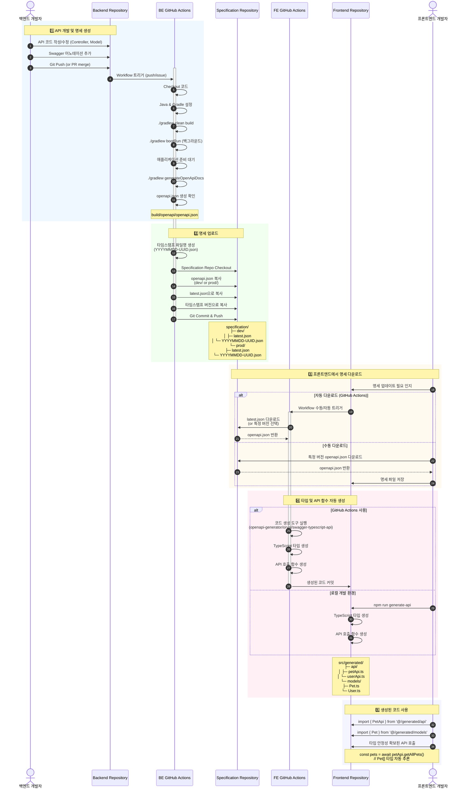

# Third Backend - Spring Boot Application

Swagger/OpenAPI가 통합된 Spring Boot REST API 애플리케이션입니다.

## 요구사항

- Java 21 이상
- Gradle 7.x 이상 (또는 포함된 Gradle Wrapper 사용)

## 실행 방법

### Gradle을 사용한 실행

```bash
gradle bootRun
```

또는 Gradle Wrapper 사용:

```bash
./gradlew bootRun
```

### JAR 파일 빌드 후 실행

```bash
gradle clean build
java -jar build/libs/third-backend-0.0.1-SNAPSHOT.jar
```

## API 문서

애플리케이션 실행 후 다음 URL에서 API 문서를 확인할 수 있습니다:

- **Swagger UI**: http://localhost:8080/swagger-ui.html
- **OpenAPI JSON**: http://localhost:8080/v3/api-docs
- **OpenAPI YAML**: http://localhost:8080/v3/api-docs.yaml

## API 명세 관리 프로세스

이 프로젝트는 백엔드에서 생성한 OpenAPI 명세를 중앙 저장소를 통해 프론트엔드와 공유하는 워크플로우를 사용합니다.



### 프로세스 설명

1. **API 개발 및 명세 생성**: 백엔드 개발자가 Controller에 Swagger 어노테이션을 포함한 API를 작성하고 Push하면 GitHub Actions가 자동으로 OpenAPI 명세를 생성합니다.

2. **명세 업로드**: 생성된 명세는 Specification Repository에 환경별(dev/prod)로 저장됩니다. 최신 버전(`latest.json`)과 타임스탬프 버전이 모두 유지됩니다.

3. **프론트엔드에서 명세 다운로드**: 프론트엔드 팀은 GitHub Actions 또는 수동으로 최신 또는 특정 버전의 명세를 다운로드합니다.

4. **타입 및 API 함수 자동 생성**: OpenAPI 명세로부터 TypeScript 타입 정의와 API 호출 함수를 자동 생성합니다.

5. **타입 안전한 개발**: 생성된 코드를 사용하여 타입 안정성이 보장된 API 호출을 수행합니다.

## API 엔드포인트

### Hello API

- `GET /hello` - "Hello Spring Boot!" 메시지를 반환합니다.

### User API

- `GET /api/users` - 모든 사용자 목록 조회
- `GET /api/users/{id}` - 특정 사용자 조회
- `POST /api/users` - 새 사용자 생성
- `PUT /api/users/{id}` - 사용자 정보 수정
- `DELETE /api/users/{id}` - 사용자 삭제

### Pet API

- `GET /api/pets` - 모든 애완동물 목록 조회 (상태별 필터링 지원)
- `GET /api/pets/{id}` - 특정 애완동물 조회
- `POST /api/pets` - 새 애완동물 등록
- `PUT /api/pets/{id}` - 애완동물 정보 수정
- `PATCH /api/pets/{id}/status` - 애완동물 상태 업데이트
- `DELETE /api/pets/{id}` - 애완동물 삭제

## 사용 예제

### 모든 사용자 조회

```bash
curl http://localhost:8080/api/users
```

### 특정 사용자 조회

```bash
curl http://localhost:8080/api/users/1
```

### 새 사용자 생성

```bash
curl -X POST http://localhost:8080/api/users \
  -H "Content-Type: application/json" \
  -d '{
    "name": "박민수",
    "email": "park@example.com",
    "age": 27
  }'
```

### 사용자 정보 수정

```bash
curl -X PUT http://localhost:8080/api/users/1 \
  -H "Content-Type: application/json" \
  -d '{
    "name": "홍길동",
    "email": "hong.updated@example.com",
    "age": 26
  }'
```

### 사용자 삭제

```bash
curl -X DELETE http://localhost:8080/api/users/1
```

### 모든 애완동물 조회

```bash
curl http://localhost:8080/api/pets
```

### 상태별 애완동물 조회

```bash
curl "http://localhost:8080/api/pets?status=available"
```

### 새 애완동물 등록

```bash
curl -X POST http://localhost:8080/api/pets \
  -H "Content-Type: application/json" \
  -d '{
    "name": "뽀삐",
    "species": "강아지",
    "age": 2,
    "status": "available"
  }'
```

### 애완동물 정보 수정

```bash
curl -X PUT http://localhost:8080/api/pets/1 \
  -H "Content-Type: application/json" \
  -d '{
    "name": "멍멍이",
    "species": "강아지",
    "age": 4,
    "status": "sold"
  }'
```

### 애완동물 상태만 업데이트

```bash
curl -X PATCH "http://localhost:8080/api/pets/1/status?status=sold"
```

### 애완동물 삭제

```bash
curl -X DELETE http://localhost:8080/api/pets/1
```

## 기술 스택

- Spring Boot 3.5.7
- SpringDoc OpenAPI 2.8.13
- Java 21
